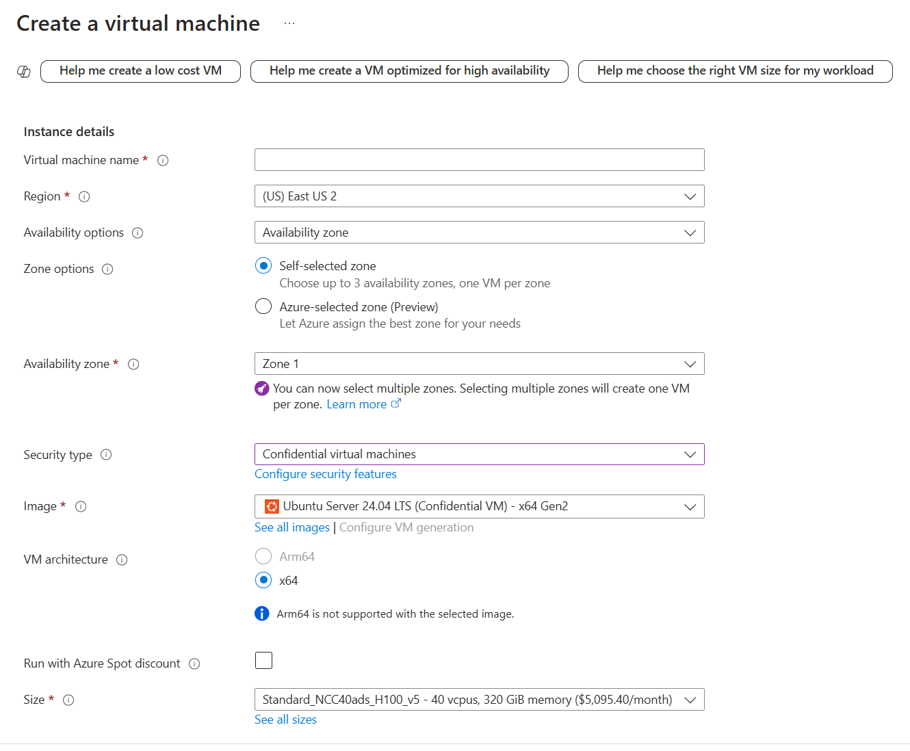

## Introduction

The following steps help create a Confidential GPU Virtual Machine with an H100 NVIDIA GPU and a Platform Managed Key (PMK) using manual instructions. This entails 2 parts: provisioning the CGPU VM and then preparing the guest environment.

-----------------------------------------------

## Steps

- [Check Requirements](#Check-Requirements)
- [Create CGPU VM](#Create-CGPU-VM)
  - [Option 1: Portal](#option-1-portal)
  - [Option 2: Azure CLI](#option-2-Azure-CLI)
  - [Option 3: ARM Template](#option-3-ARM-Template)
- [CGPU Environment Setup](#CGPU-Environment-Setup)
  - [Upload Package](#Upload-Package)
  - [Run Onboarding Package Steps](#Run-Onboarding-Package-Steps)
  - [Validation](#Validation)
  - [Workload Running](#Workload-Running)

-------------------------------------------

## Check-Requirements

Please make sure you have these requirements before performing the following steps: 
- [Powershell](https://learn.microsoft.com/en-us/powershell/scripting/install/installing-powershell-on-windows?view=powershell-7.4#msi): version 7 and above (please run windows powershell as administrator)
- [Azure Subscription](https://docs.microsoft.com/en-us/azure/cost-management-billing/manage/create-subscription)
  - This subscription needs to have been granted sufficient quotas for the NCC_H100_v5 SKU in order to successfully deploy any CGPU VMs
- [Azure Tenant ID](https://learn.microsoft.com/en-us/azure/active-directory/fundamentals/active-directory-how-to-find-tenant#find-tenant-id-with-powershell)
- [Install Azure CLI](https://docs.microsoft.com/en-us/cli/azure/install-azure-cli)
  - Note: minimum version 2.46.0 is required, run `az --version` to check your version and run `az upgrade` to install the latest version if your version is older
- Download [cgpu-onboarding-package.tar.gz](https://github.com/Azure/az-cgpu-onboarding/releases/download/V3.0.7/cgpu-onboarding-package.tar.gz) from [az-cgpu-onboarding-V3.0.7](https://github.com/Azure/az-cgpu-onboarding/releases/tag/V3.0.7)

-------------------------------------------

## Create-CGPU-VM
There are multiple ways you can manually provision a CGPU VM. We have instructions to deploy one using the portal, using the Azure command line interface, and using an ARM template.

### Option 1: Portal
There is general documentation to create VMs through the portal found [here](https://learn.microsoft.com/en-us/azure/virtual-machines/windows/quick-create-portal). In order to deploy a CGPU VM please select the following configurations under the Instance Details:
```
Region: must be eastus2 or westeurope
Security Type: Confidential virtual machines
Image: Ubuntu server, must support Confidential virtual machines
Size: Standard_NCC40ads_H100_v5
```

An example is shown below: 

### Option 2: Azure CLI

1. Log in to your azure account and ensure you are under the right subscription that has quota for this VM:
```
az login
az account set --subscription <your subscription ID>
```

2. Deploy an NCC40 CGPU VM by replacing the following parameters with your own:

Required Parameters:
- $rg = your resource group name. If it does not already exist, it will create a new one
- $vmname = the name of the virtual machine you want to deploy
- $adminusername = the username you will use to log in to your virtual machine
- $publickeypath = the path to your local public key 

Additional optional parameters:
- $location = the region you would like to deploy to. Currently we support eastus2 and westeurope
- $osdisksize = the size of your OS disk. The maximum size is 4095 GB and for default, set to 100 GB

Please note that this step may take a few minutes to complete. You can track your deployment in the portal under your resource group.
```
az vm create `
--resource-group $rg `
--name $vmname `
--location $location `
--image Canonical:0001-com-ubuntu-confidential-vm-jammy:22_04-lts-cvm:latest `
--public-ip-sku Standard `
--admin-username $adminusername `
--ssh-key-values $publickeypath `
--security-type ConfidentialVM `
--os-disk-security-encryption-type DiskWithVMGuestState `
--enable-secure-boot $true `
--enable-vtpm $true `
--size Standard_NCC40ads_H100_v5 `
--os-disk-size-gb $osdisksize `
--verbose
```

### Option 3: ARM Template
An Azure Resource Manager (ARM) template is a JSON file that defines the resources and specifications needed to deploy a VM. To deploy a CGPU VM using an ARM template, use the following command with your own specifications and parameters:

```
az group create --resource-group $<your resource group> --location "westeurope"
az deployment group create -g $rg -f "<your ARM template.json>" -p "<your parameter file.json>" 
```

A sample ARM template and parameter file for deploying a CGPU VM can be found here: [template.json](template.json) and [parameters.json](parameters.json).

----------------------------------------------------

## CGPU Environment Setup
Once your CGPU VM has been successfully deployed, there are several steps to configure the guest environment. These involve uploading our onboarding package, running the scripts within, validate the state of your VM, and optionally running a sample workload.

### Upload-Package

1. Once your virtual machine is created, manually upload the cgpu-onboarding-package that you downloaded from the release:
- $privatekeypath = the path to your local private key 
- $cgpupackagepath = the location where you downloaded the onboarding package to (ex: "C:\Users\username\Downloads\cgpu-onboarding-package.tar.gz")
- $adminusername = the username you set to log in
- $vmip = the public IP address of your deployed virtual machine

```
scp -i $privatekeypath $cgpupackagepath $adminusername@$vmip:/home/${adminusername}
```

2. Log in to your virtual machine and extract the contents of the onboarding package

```
ssh -i ${privatekeypath} $adminusername@$vmip
tar -zxvf cgpu-onboarding-package.tar.gz
```

### Run-Onboarding-Package-Steps
1. Once the package has been extracted, enter the folder and run step 0 to prepare the kernel
```
cd cgpu-onboarding-package
sudo bash step-0-prepare-kernel.sh
```
Note: this step requires a reboot, so once your VM status is back to 'running' please re-connect and re-enter the onboarding package to continue:
```
ssh -i ${privatekeypath} $adminusername@$vmip
cd cgpu-onboarding-package
```

2. The next step will install the GPU driver. Please note that this step will involve a reboot
```
sudo bash step-1-install-gpu-driver.sh
```

3. Now we are finally able to run attestation - you will be able to see the attestation message printed at the bottom
```
sudo bash step-2-attestation.sh
```

4. Finally, run the last step to install the GPU tools. These are tools and packages that will allow you to run various workloads
```
sudo bash step-3-install-gpu-tools.sh
```

### Validation
In order to confirm that all the steps were performed successfully and to ensure that your CGPU VM is in the proper state, you can use the following commands:

1. Check whether secureboot is enabled:
```
mokutil --sb-state
```
You should see: "SecureBoot enabled"

2. Check whether the confidential compute mode (CC Mode) is enabled:
``` 
nvidia-smi conf-compute -f
```
You should see: "CC status: ON"

3. Check the confidential compute environment:
```
nvidia-smi conf-compute -e
```
You should see: "CC Environment: PRODUCTION"

### Workload-Running
Once you have finished the validation, you can execute the following commands to try a sample workload:

```
sudo docker run --gpus all --ipc=host --ulimit memlock=-1 --ulimit stack=67108864 -v /home/${adminusername}/cgpu-onboarding-package:/home -it --rm nvcr.io/nvidia/tensorflow:24.05-tf2-py3 python /home/mnist-sample-workload.py
```

If you have reached this point, congratulations! You have offically manually created an NCC40 CGPU VM!
