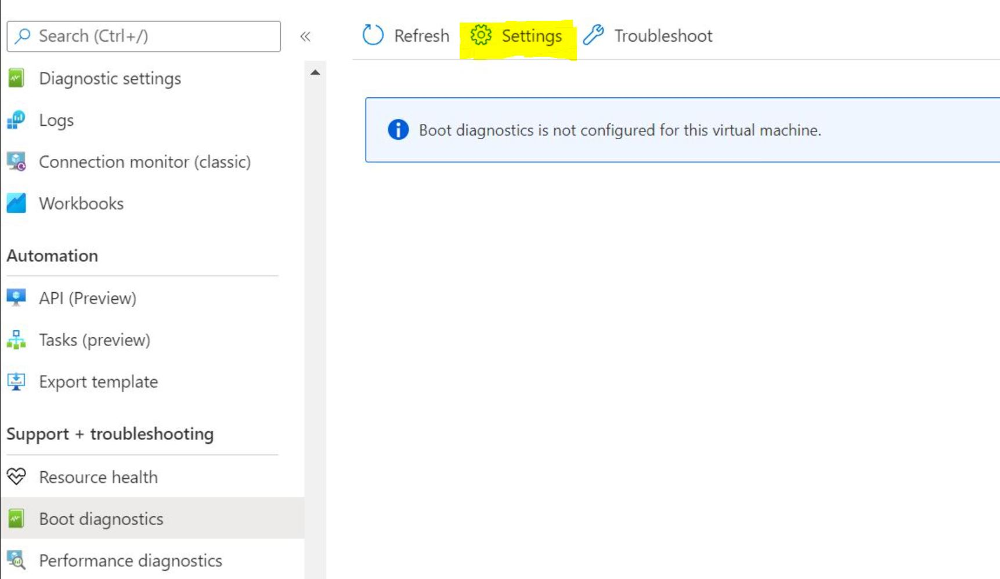
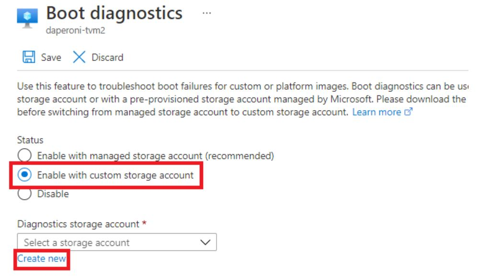
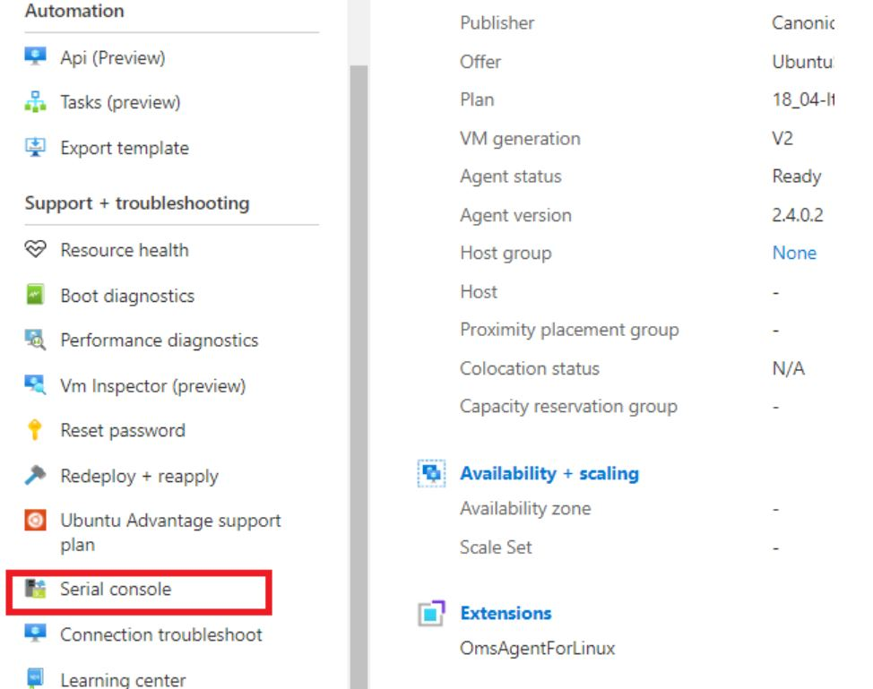
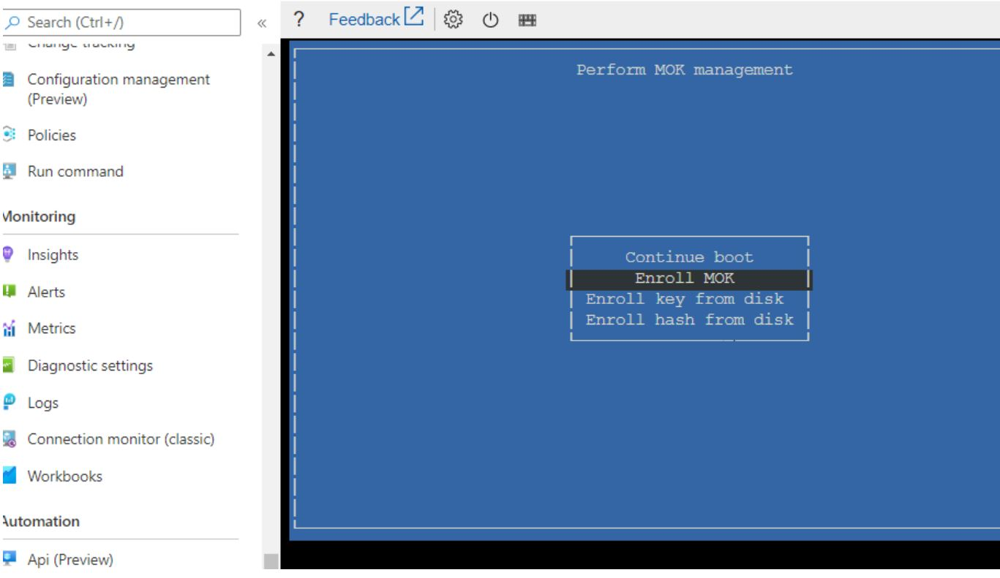

## Introduction

The following steps help create a [secure boot](https://docs.microsoft.com/en-us/azure/virtual-machines/trusted-launch) enabled Confidential GPU Virtual Machine with a Windows operating system.

-----------------------------------------------

## Steps

- [Create-CGPU-VM](#Create-CGPU-VM)
- [Enroll-Key-TVM](#Enroll-Key-TVM)
- [Install-GPU-Driver](#Install-GPU-Driver) 
- [Attestation ](#Attestation) 
- [Workload-Running](#Workload-Running) 

----------------------------------------

## Requirements

- Windows
- Powershell: version 5.1.19041.1682 and above
- [Azure Subscription](https://docs.microsoft.com/en-us/azure/cost-management-billing/manage/create-subscription)
- [Install Azure CLI](https://docs.microsoft.com/en-us/cli/azure/install-azure-cli) 
- Download [CgpuOnboardingPakcage.tar.gz](https://github.com/Azure-Confidential-Computing/PrivatePreview/releases/download/V1.0.1/CgpuOnboardingPackage.tar.gz) from [Azure-Confidential-Computing-CGPUPrivatePreview-v1.0.1](https://github.com/Azure-Confidential-Computing/PrivatePreview/releases/tag/V1.0.1)

-----------------------------------------


### Create-CGPU-VM

1. Prepare ssh key for creating VM (if you don't have one)
```
# id_rsa.pub will used as ssh-key-values for VM creation.
# id_rsa will be used for ssh in your vm
E:\cgpu\.ssh>ssh-keygen -t rsa -b 4096 -C example@gmail.com
Generating public/private rsa key pair.

Enter file in which to save the key (C:\Users\soccerl/.ssh/id_rsa): e:\cgpu/.ssh/id_rsa
e:\cgpu/.ssh/id_rsa already exists.

Overwrite (y/n)? y

Enter passphrase (empty for no passphrase):
Enter same passphrase again:

Your identification has been saved in e:\cgpu/.ssh/id_rsa.
Your public key has been saved in e:\cgpu/.ssh/id_rsa.pub.
The key fingerprint is:
SHA256:YiPxu6SEIlIXmYKUzprXDhXqI13gLYmcyQzGNYGmdtk example@microsoft.com
The key's randomart image is:
+---[RSA 4096]----+
|..++.            |
|oB. oo           |
|%o+=B.           |
|oX=++E           |
|o+o=o = S        |
|+.*o.o +         |
|+o.+. o          |
|o. ..o .         |
|    . .          |
+----[SHA256]-----+
```


2. Create VM using Azure CLI
```
# azure admin user name
$adminusername="your user name"

# resource group name
$rg="your resource group name"

# vm name 
$vmname="your vm name"

# ssh pub key generated from step1.
$SshCreds="ssh-rsa AAAAB3NzaC..."


# login in with your azure account
Az login

# Check if you are on the right subscription
az account show

# switch subscription if needed.
az account set --subscription [your subscriptionId]

# if you don't have resource group, execute this command for creating an resource group
az group create --name $rg --location eastus2


# create VM with (takes few minute to finish)
az vm create `
--resource-group $rg `
--name $vmname `
--image Canonical:0001-com-ubuntu-server-focal:20_04-lts-gen2:latest `
--public-ip-sku Standard `
--admin-username $adminusername `
--ssh-key-values $SshCreds `
--security-type "TrustedLaunch" `
--enable-secure-boot $true `
--enable-vtpm $true `
--size Standard_NCC24ads_A100_v4 `
--os-disk-size-gb 100 `
--verbose

```
 3. Check your VM connection using your private key and verify secure boot enabled. 
```
# Use your private key file path generated in above and replace the [adminusername] and ip address below to connect to VM
# The IP address could be found in VM Azure Portal.
ssh -i <private key path> -v [adminusername]@20.94.81.45

# check security boot state, you should see : SecureBoot enabled
mokutil --sb-state

# Success: /dev/tpm0, Failure: ls: cannot access '/dev/tpm0': No such file or directory
ls /dev/tpm0
```


----------------------------------------------------------------

### Enroll-Key-TVM

Download [CgpuOnboardingPakcage.tar.gz](https://github.com/Azure-Confidential-Computing/PrivatePreview/releases/download/V1.0.1/CgpuOnboardingPackage.tar.gz) from [Azure-Confidential-Computing-CGPUPrivatePreview-v1.0.1](https://github.com/Azure-Confidential-Computing/PrivatePreview/releases/tag/V1.0.1) if you haven't.

```
# In local, upload CgpuOnboardingPackage.tar.gz to your VM.
scp -i id_rsa CgpuOnboardingPackage.tar.gz -v [adminusername]@20.110.3.197:/home/[adminusername]

# In your VM, create a password for the user if it is not already set
sudo passwd [adminusername]

# In your VM, extract the onboarding folder from tar.gz, then step into the folder
tar -zxvf CgpuOnboardingPackage.tar.gz

# Execute the following script to import nvidia signing key.
cd CgpuOnboardingPackage 
bash step-0-install-kernel.sh

```
- Go to your VM portal to set the boot diagnostics. 
- This update process may take several minutes to propagate.


- You can select existing one or create a new one with default configuration.


- Go to the Serial Console and login with your adminUserName and password


- Reboot the machine from Azure Serial Console by typing sudo reboot. A 10 second countdown will begin. Press up or down key to interrupt the countdown and wait in UEFI console mode. If the timer is not interrupted, the boot process continues and all of the MOK changes are lost. Select: Enroll MOK -> Continue -> Yes -> Enter your signing key password ->  Reboot.


----------------------------------------------------------------


### Install-GPU-Driver


```
# After the reboot is finished, ssh into your VM and install the right version kernel folder.
# This step requires a reboot. Afterwards, please wait about 2-5 minutes to reconnect to the VM
cd CgpuOnboardingPackage 
bash step-1-install-kernel.sh

# After rebooting, reconnect to the VM and install GPU-Driver in CgpuOnboardingPackage folder.
# This step also requires a reboot. Please wait about 2-5 min to reconnect to the VM
cd CgpuOnboardingPackage 
bash step-2-install-gpu-driver.sh

# After rebooting, reconnect to the VM and validate if the confidential compute mode is on.
# You should see: CC status: ON
nvidia-smi conf-compute -f 

```


----------------------------------------------------------------


### Attestation
```
# In your VM, execute attestation scripts in CgpuOnboardingPackage.
# You should see: GPU 0 verified successfully.
cd CgpuOnboardingPackage 
bash step-3-attestation.sh
```

-----------------

### Workload-Running

```
# In your VM, execute install gpu tool scripts to pull associates dependencies
cd CgpuOnboardingPackage 
bash step-4-install-gpu-tools.sh

# Replace the [adminusername] with your admin user name. Then try to execute sample workload with docker.
# It will download docker image if it couldn't find it.
sudo docker run --gpus all -v /home/[adminusername]/CgpuOnboardingPackage:/home -it --rm nvcr.io/nvidia/tensorflow:21.10-tf2-py3 python /home/unet_bosch_ms.py

```


