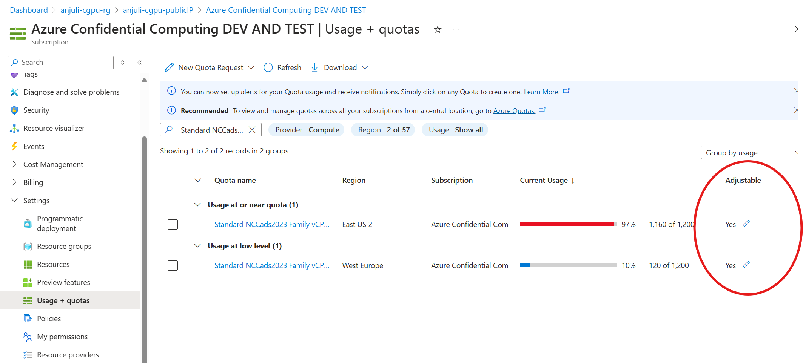
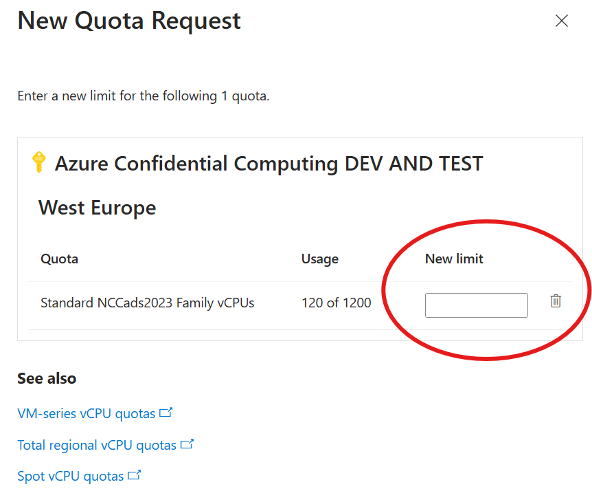

# Frequently Asked Questions

Below are a list of frequently asked questions and answers.

## Q: How can I get quota for creating an NCC CGPU VM?

A: If you do not have quota in your subscription for the `Standard NCCads2023 Family vCPUs` SKU, you will need open a new quota request ticket. In order to check your current quota status, within the Azure portal, go to your subscription page and under the 'Settings' tab, select 'Usage + quotas'. Here you should be able to filter and see your current quota status and usage. If you do not have quota, or would like to request additional quota, select the 'Yes' button under the 'Adjustable' column to fill out a request:  From here, fill out the form as follows with the new desired quota amount: 


## Q: How can I capture an image of my CGPU VM and share it?

A: Please refer to this page that contains detailed information on different VMI scenarios and which options are supported: [VMI Sharing Instructions](VMI-Sharing-Instructions.md)


## Q: How can I use OpenSSL `(>=3.1.0)` for Confidential H100 GPU bandwidth improvement?

OpenSSL version 3.1.0 and above are known to significantly improve the bandwidth between H100 Confidential GPU and CPU, thanks to the encryption performance boost provided by AVX512.

We have created a script to build and install OpenSSL 3.3.1 to `/opt/openssl` where you have the option to specify the `LD_LIBRARY_PATH` to `/opt/openssl/lib64`. Note that the system's OpenSSL 3.0.2 remains untouched and continues to be the default version.

Run the following command to install it: 
```
sudo bash utilities-install-openssl.sh
```
For more specifics on H100 GPU bandwidth using the different versions of SSL, refer to the [OpenSSL-Details](OpenSSL-Details.md) page.


## Q: How can I deploy my CGPU VM manually if I don't want to run the auto-onboarding scripts?

A: We have detailed out the options to deploy a CGPU VM manually [here](Confidential-GPU-H100-Manual-Installation-(PMK-for-Windows).md). It also contains the following steps needed to fully set up the CGPU environment in order to run a sample workload.


## Q: Why does the `dmesg` not display `AMD SEV-SNP`?

A: This is the intended behavior because the AMD SEV-SNP offering on Azure runs in the vTOM (virtual Top of Memory) mode and the SEV-SNP CPUID capability is not exposed to the VM, though SEV-SNP is in use. In such a CVM, the native attestation interface /dev/sev-guest is unsupported; instead, the VM should perform attestation via vTPM.
To detect such an AMD SEV-SNP VM on Azure, a user should check the CPU leaves below :
CPUID leaf 0x40000003’s EBX.bit22 is 1 AND
CPUD leaf 0x4000000C’s EAX.bit0 is 1, and EBX.bit 0~3 is 2.
(refer to https://elixir.bootlin.com/linux/latest/source/arch/x86/kernel/cpu/mshyperv.c#L445)

NVIDIA is working on implementing SEV-SNP checks for Hyper-V and are planning on will releasing it with the TRD5 release in September 2024.

## Q: How can I check my CGPU VM's HyperV SEV-SNP status is enabled?

A: Use the following command to check the HyperV SEV-SNP enablement on your machine: 
```
sudo apt-get update
sudo apt install cpuid
cpuid -l 0x4000000C -1 | awk '$4 ~ /^ebx=.*2$/ { print "AMD SEV-SNP is enabled"}'
```

For more detailed information on how to perform guest attestation for Azure SEV-SNP CVM, please refer to the following page: [SNP Guest Attestation](SNP-Guest-Attestation-Verification.md)

## Q: Can I get NVMe support for my CGPU VM?

A: NVMe support is currently not supported for CGPU VMs, but this feature is being worked on for future releases. There are bugs that show NVMe attachment support when creating CGPU VMs from the Azure portal which we are working to resolve.

## Q: My question is not listed above, where can I find the answer?
If you are using an older release version and your question is not listed below, please try checking the [Legacy FAQ](Legacy-FAQ.md) page.
