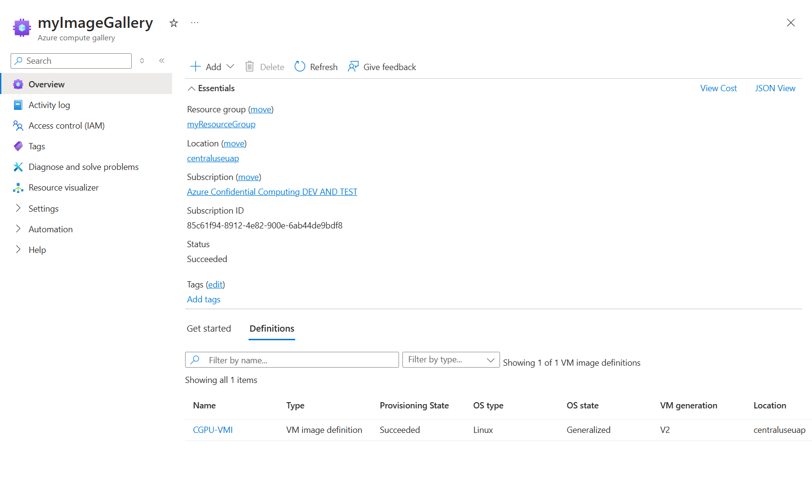

# Overview
Here is an overview of the different options to capture and share a CGPU VM image. In general, creating a SIG is simpler than storing things in a container since those are shared on a subscription/tenant-basis. 

Please note that the Azure Compute Gallery's direct share feature is still in a preview, so it is subject to their preview terms and conditions. Since it is still in preview, there are several onboarding steps required in order to use this feature. To learn more about it, take a look at their documentation and follow their instructions [here](https://learn.microsoft.com/en-us/azure/virtual-machines/share-gallery-direct?tabs=portaldirect).

These are the steps involved with creating and sharing a virtual machine image (VMI):
1. Create an image gallery
2. Create an image definition and an image cersion based off your CGPU VM
3. Determine the right sharing configurations for your usecase
4. Use the shared image gallery (SIG) or Azure Storage to share your image

If you have already created an Azure image gallery and definition, skip to the instructions on how to [share within a subscription](#sharing-within-a-subscription) or [share to other subscriptions or tenants](#sharing-to-other-subscriptions-or-tenant). If not, refer to the below documentations that contain detailed information on how to set up your image gallery and definitions:

1. [Create an image definition and an image version](https://learn.microsoft.com/en-us/azure/virtual-machines/image-version?tabs=portal%2Ccli2).
2. More details on storing and image sharing options can be found here: [SStore and share images in an Azure Compute Gallery](https://learn.microsoft.com/en-us/azure/virtual-machines/shared-image-galleries?tabs=vmsource%2Cazure-cli)

Before moving on to the sharing steps, please ensure you have a gallery and image definition similar to this example: 


# Sharing within a subscription
Option 1: Export the image and VMGS file using a shared image gallery (SIG)

When creating the image definition, make sure to select the right security type for your use case:

1. `ConfidentialVM` security type is required for images using Confidential disk encryption (`ConfidentialVMSupported` security type for encrypted images will fail). This security type is only allowed to be shared within subscriptions.

2. `ConfidentialVMSupported` security type is supported for unencrypted images. This security type is allowed to be shared within subscriptions and tenants.

- Note: if the VM was created with an encrypted disk and customer-managed keys (CMK), `Confidential Disk Encryption` must be set to `True`


# Sharing to other subscriptions or tenant
Option 1: Share an unencrypted image using the shared image gallery (SIG) direct share feature
- Must set security type to `ConfidentialVMSupported`

Option 2: Share an encrypted image using Azure Storage
- The following is a workaround that allows you to create an image or VM based off an existing VM by copying the disks to an Azure Storage container. This example uses a PMK flow: 
 
```
# Base resource to save as an image (e.g. from onboarding script)
$base_rg = "<your rg name>"
$base_vm_name = "<your vm name>"

az vm deallocate -g $base_rg -n $base_vm_name

$base_disk_name = $(az vm show -g $base_rg -n $base_vm_name | jq -r .storageProfile.osDisk.name)

# Export both the OS VHD and the VMGS file
$disk_uris = az disk grant-access --access-level Read --duration-in-seconds 3600 --name $base_disk_name --resource-group $base_rg --secure-vm-guest-state-sas
 
$disk_uri = $disk_uris | jq -r ".accessSas"
$vmgs_uri = $disk_uris | jq -r ".securityDataAccessSas"
 
# Copy both uris to a storage account
$storageAccountId = az storage account show -g "<storage account rg>" -n "<storage account name>" | jq -r .id
$vhd_uri = "https://<storage account>.blob.core.windows.net/path/to/dest.vhd"
$security_data_uri = "https://<storage account>.blob.core.windows.net/path/to/dest.vmgs"
$sas = "<storage account SAS token>"

.\azcopy copy $vmgs_uri $($security_data_uri + "?" + $sas) --s2s-preserve-access-tier=false
.\azcopy copy $disk_uri $($vhd_uri + "?" + $sas) --s2s-preserve-access-tier=false
 
# Destination resource to create from the base image - can be in a different subscription as long as you have access
$rg = "<your new rg name>"
$disk_name = "<your disk name>"
$vm_name = "<your new vm name>"
 
az group create -n $rg -l eastus2
az disk create -g $rg -n $disk_name --source $vhd_uri --security-data-uri $security_data_uri --security-type ConfidentialVM_DiskEncryptedWithPlatformKey --size-gb 100 --hyper-v-generation V2 --source-storage-account-id $storageAccountId
 
az vm create --resource-group $rg --name $vm_name --attach-os-disk $disk_name --public-ip-sku Standard --security-type ConfidentialVM --os-disk-security-encryption-type DiskWithVMGuestState --enable-secure-boot true --enable-vtpm true --size Standard_NCC40ads_H100_v5 --os-type Linux --verbose
```

# Future investigations:
There are still a few scenarios we want to look into:
1. Using a non-Confidential VM to create the image: export the generalized VHD, upload it to a storage blob, create an image definition using the portal, create image version, and add customer subscription/tenant to the direct share