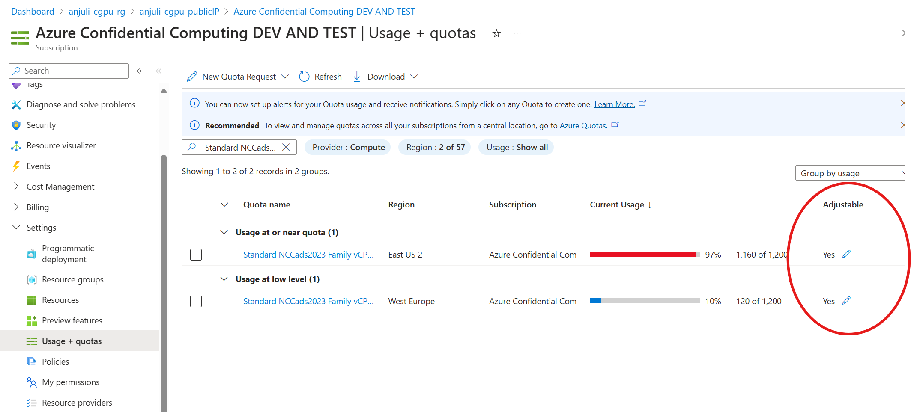
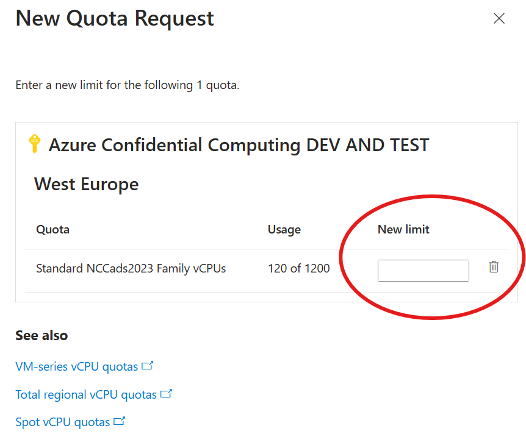
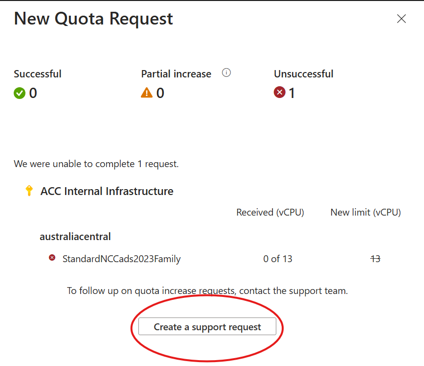

# Quota Overview
In order to deploy a CGPU VM, you need quota granted for this specific SKU: `Standard NCCads2023 Family vCPUs`.

If you do not have quota in your subscription for this SKU or are needing to get more quota, you will need open a new quota request ticket. In order to check your current quota status, within the Azure portal, go to your subscription page and under the 'Settings' tab, select 'Usage + quotas'. Here you should be able to filter and see your current quota status and usage. If you do not have quota, or would like to request additional quota, select the 'Yes' button under the 'Adjustable' column to fill out a request:  

Here, fill out the form as follows with the new desired quota amount: 

Once you submit this form, it will take a few minutes for the request to be reviewed. It may show that the request is unsuccessful, at which point you can select the `Create a support request` button and fill out the additional details required:

Once you submit this ticket, it can take up to 48 hours before your subscription is granted access at which point you can begin deploying CGPU VMs!