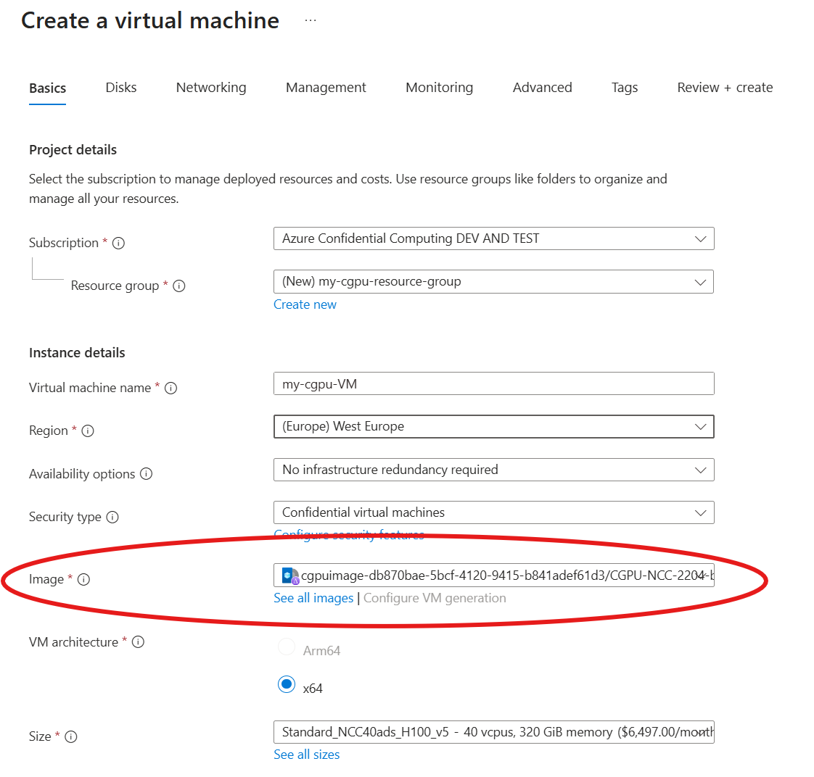
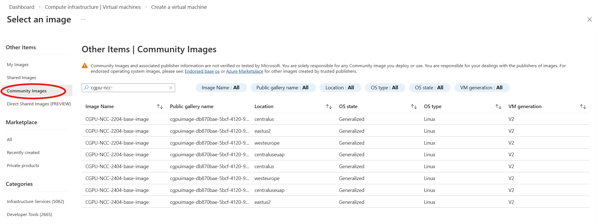
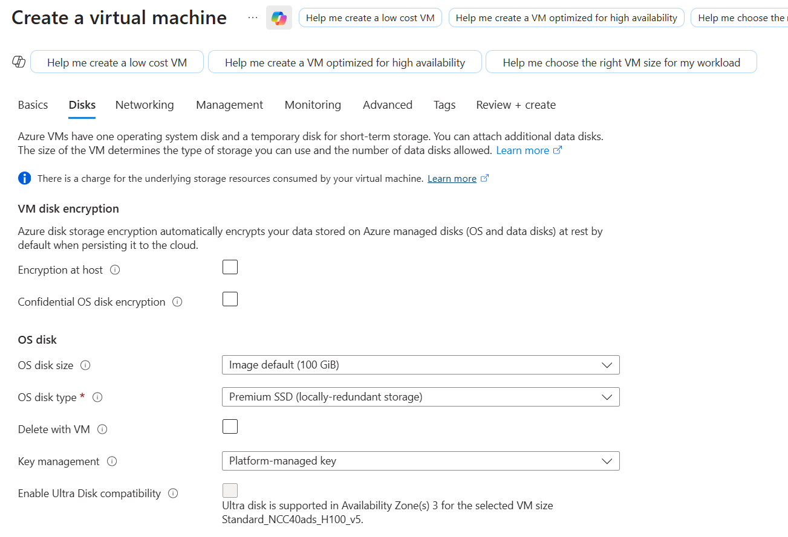

## Introduction

The following steps help create a Confidential GPU Virtual Machine with an H100 NVIDIA GPU with either a Platform Managed Key (PMK) or a Customer Managed Key (CMK) using a community shared image in the Azure Compute Gallery. Please follow the instructions to deploy using the Azure portal experience.

Detailed documentation on features and limitations of the Compute Gallery's community images can be found here: [Community Gallery](https://learn.microsoft.com/en-us/azure/virtual-machines/share-gallery-community?tabs=cli)

-----------------------------------------------

## Steps

- [Check Requirements](#Check-Requirements)
- [Create CGPU VM using Azure Portal](#create-cgpu-vm-using-azure-portal)
- [Attestation](#attestation)
- [Validation](#Validation)
- [Workload Running](#Workload-Running)

-------------------------------------------

## Check-Requirements

Please make sure you have these requirements before performing the following steps: 
- [Azure Subscription](https://docs.microsoft.com/en-us/azure/cost-management-billing/manage/create-subscription)
- [Quota for the NCC H100 v5 VM SKU](../Frequently-Asked-Questions.md#q-how-can-i-get-quota-for-creating-an-ncc-cgpu-vm)
- [Azure Tenant ID](https://learn.microsoft.com/en-us/azure/active-directory/fundamentals/active-directory-how-to-find-tenant#find-tenant-id-with-powershell)

-------------------------------------------

## Create CGPU VM Using Azure Portal
If you would like to provision your CGPU using the Azure portal, search for "Virtual Machine" in the search bar and select the option under the listed services. Select the following properties when creating your VM. Please ensure `Confidential virtual machines` is selected under the Security Type and `Standard_NCC40ads_H100_v5` is selected as the size: 



The image can be found by clicking the `See all images` button under the dropdown and navigating to the `Community Images` tab on the left. Here you can search for `cgpu-ncc` which should display all the region and OS options that are offered. The public gallery name is `cgpuimage-db870bae-5bcf-4120-9415-b841adef61d3`. Please make sure to select an image that is in the same region as your resource group.


You may see multiple images that match your desired region and OS. The image listed at the top is the most recently published version.

Disk settings, including disk encryption and disk size, can be configured under the `Disks` tab: 

More details about disk options can be found here: [Confidential computing disk configuration](https://learn.microsoft.com/en-us/azure/confidential-computing/quick-create-confidential-vm-portal#:~:text=On%20the%20tab%20Disks%2C%20configure%20the%20following%20settings%3A)

## Attestation
Once your CGPU VM is up and running, you can connect and run the following command to run attestation:
```
sudo cpu-attestation
sudo gpu-attestation
```

For the cpu-attestation, you should see a message ending in: "2026-04-16 21:30:43,507 - print_snp_platform_claims - INFO - Attested Platform Successfully!!" 

For the gpu-attestation, you should see a message ending in: "GPU Attestation is Successful."

To learn more about attestation and what it guarantees, here is the documentation with all the details: [Azure Attestation Overview](https://learn.microsoft.com/en-us/azure/attestation/overview)

## Validation
Optionally, the following commands can be run to gather more information about the state of your CGPU VM:

1. Check whether secureboot is enabled:
```
mokutil --sb-state
```
You should see: "SecureBoot enabled"

2. Check whether the confidential compute mode (CC Mode) is enabled:
``` 
nvidia-smi conf-compute -f
```
You should see: "CC status: ON"

3. Check the confidential compute environment:
```
nvidia-smi conf-compute -e
```
You should see: "CC Environment: PRODUCTION"

4. List the GPU information:
```
nvidia-smi
```

## Workload Running
Once you have finished the validation, you can execute the following commands to try a sample workload:

```
sudo docker run --runtime=nvidia --rm --gpus all nvidia/cuda:12.8.1-base-ubuntu22.04 nvidia-smi
```

If you would like to run a more complex sample, you can download this repo within your CGPU VM and run the mnist workload:
```
git clone https://github.com/Azure/az-cgpu-onboarding.git

# Please replace <adminusername> with your username below:

sudo docker run --runtime=nvidia --gpus all --ipc=host --ulimit memlock=-1 --ulimit stack=67108864 -v /home/<adminusername>/az-cgpu-onboarding:/workspace -it --rm nvcr.io/nvidia/pytorch:26.04-py3 python /workspace/src/mnist-sample-workload.py
```


If you have reached this point, congratulations! You have offically created an NCC40 CGPU VM!
