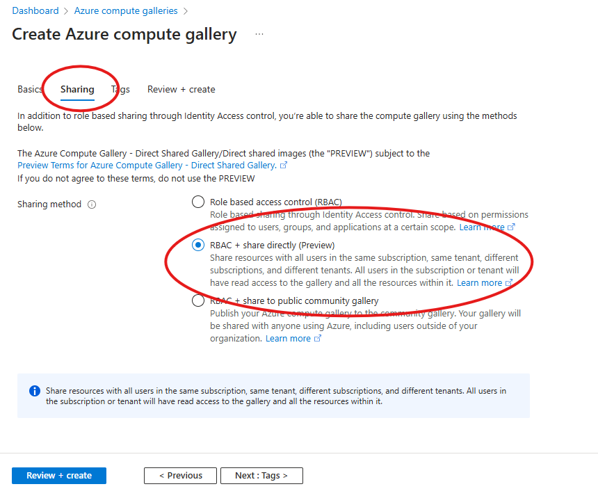
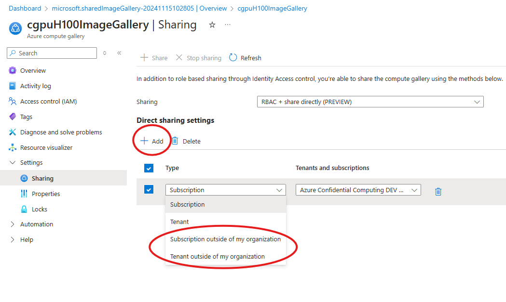

# Overview
Here is an overview of the different options to capture and share a CGPU VM image across different subscription. 

These instructions use the Azure Compute Gallery's direct share feature. Please note that this feature is still in a preview, so it is subject to their preview terms, conditions and limitations. Please double-check the [limitations](https://learn.microsoft.com/en-us/azure/virtual-machines/share-gallery-direct?tabs=portaldirect#limitations) to ensure it works for your use case. Since it is still in preview, there are several onboarding steps required in order to use this feature. To learn more about it, take a look at their documentation and follow their instructions [here](https://learn.microsoft.com/en-us/azure/virtual-machines/share-gallery-direct?tabs=portaldirect). 

These are the steps involved with creating and sharing a virtual machine image (VMI):
1. Create an image gallery with an image definition and an image version based off your CGPU VM
2. Share your image
3. Use the shared image

If you have already created an Azure image gallery and definition, skip to the instructions on how to [share your VMI](#sharing-within-a-subscription). If not, refer to the following instruction on how to set up your image gallery and definitions:

## Create an image definition and version
Detailed documentation on creating an image definition and image version can be found [here](https://learn.microsoft.com/en-us/azure/virtual-machines/image-version?tabs=portal%2Ccli2).

Please note that the security type of your base VM must be set to `Confidential supported` or `Trusted launch and confidential supported`. If the OS disk is encrypted via `DiskWithVMGuestState`, the disk will be encypted and will not enable it to be used for created Confidential supported images. 

### 1. Create an image gallery
First create an Azure Image Gallery which will be used to store and share your images. When creating this gallery, please make sure to navigate to the `Sharing` tab and select the `RBAC + direct share (Preview)` option to ensure the direct share feature is enabled for your gallery:


### 2. Create a storage account
Next create a storage account. The storage account must be `Storage V2 Premium_LRS`. This is where the your OS disk will get uploaded in the format of a VHD file.

### 3. Export the VHD
Once you have a storage account, replace the following parameters with your own values and run the commands to generalize the VM and export the VHD.
```
# set your own parameters
vm_rg_name="<your resource group>"
vm_name="<your vm name>"
private_key_path="<path to your private key>"
username="<your username>"
image_rg="<your image gallery's resource group>"
gallery_name="<your image gallery name>"
image_definition_name="<your image definition name>"
image_version="<your image version>"
storageaccount_id="/subscription/<your storage account ID>"

# set the desired path to your VHD
vhd_uri="https://<your storage account name>.blob.core.windows.net/path/to/file.vhd" 

# generalize the VM to remove machine-specific information
ssh_opts=(-o "ConnectTimeout 10" -o "BatchMode yes" -o "ConnectionAttempts 10")
public_ip=$(az vm show -d -g $vm_rg_name -n $vm_name --query "publicIps" -o tsv)
ssh "${ssh_opts[@]}" -i $private_key_path $username@$public_ip "sudo waagent -deprovision+user -force"
az vm deallocate -g $vm_rg_name -n $vm_name
az vm generalize -g $vm_rg_name -n $vm_name

# extract the OS disk ID and a SAS token to read it
os_disk_id=$(az vm show -d -g $vm_rg_name -n $vm_name --query "storageProfile.osDisk.managedDisk.id" -o tsv)
disk_sas=$(az disk grant-access --access-level Read --duration-in-seconds 3600 --ids $os_disk_id --query "accessSas" -o tsv)
```

### 4. Upload the VHD to a storage account
Next, upload the OS disk to the storage account previously created. This disassociates the disk from a Confidential Virtual Machine (CVM) and enables it to be used for CVM-supported images. The following commands use `azcopy` to upload, if you do not already have it installed, please refer to the documentation and installation instructions [here](https://learn.microsoft.com/en-us/azure/storage/common/storage-use-azcopy-v10?tabs=dnf).

```
export AZCOPY_AUTO_LOGIN_TYPE="AZCLI"
azcopy copy "$disk_sas" "$vhd_uri" --blob-type PageBlob
```

### 5. Create an image definition with security type ConfidentialVMSupported
Once the OS disk has been uploaded to your storage account, you can use it to create a new image version:

```
az sig image-version create --resource-group $image_rg --gallery-name $gallery_name --gallery-image-definition $image_definition_name --gallery-image-version $image_version --location eastus2 --os-vhd-storage-account $storageaccount_id --os-vhd-uri $vhd_uri --target-regions "eastus2=1=standard_zrs" "westeurope=1=standard_zrs" --replica-count 1 --storage-account-type "standard_zrs" --replication-mode Full
```

You should now have a gallery and image definition like this: 


## Sharing to other subscriptions or tenant
Sharing the VMI is done by using the previously mentioned Compute Gallery with the new direct share feature. Within your image gallery, under the `Sharing` tab, select `Add` and choose the option that allows you to share with your intended audience like shown here: 

## Deploying a VM based off a shared VMI
Once the VMI has been shared, there are 3 options to use it to deploy a VM:

### 1. Using the portal
If deploying a VM using the Azure portal, navigate to `Create a Virtual Machine`. When under `Select an image` click on `Direct Shared Images (PREVIEW)` to see all the images that have been shared with your subscription or tenant and are now available for your use.

### 2. Using the Azure CLI
If deploying a VM using the Azure CLI, ensure the image reference is in the following format, where <subscription ID>, <resource group name>, <image gallery name>, <image name>, and <version number> are replaced with those from the VMI:
`image-reference = "/SharedGalleries/<subscription ID>-<image gallery name>/Images/<image name>/Versions/<version number>"`

Once the image reference is in the correct format, a VM can be deployed by including this in the parameters:
```
az vm create \
  --resource-group <your-resource-group> \
  --name <your-vm-name> \
  --image <image-reference> \
  --admin-username <your-username> \
  --generate-ssh-keys
```
### 3. Using an ARM template
If deploying a VM using an ARM template, replace the storage profile image reference with the reference to the intended image as below:
```
"storageProfile": {
            "imageReference": {
                "id": "/subscriptions/<subscription ID>/resourceGroups/<resource group name>/providers/Microsoft.Compute/galleries/<image gallery name>/images/<image definition name>/versions/<version number>",
                "exactVersion": "0.0.1"
            },
```

Then the ARM template can be used to deploy using the Azure CLI:
```
az deployment group create \
  --resource-group <your-resource-group> \
  --template-file <your-ARM-template> \
  --parameters vmName=<your-vm-name> adminUsername=<your-username> adminPassword=<your-password>
```
