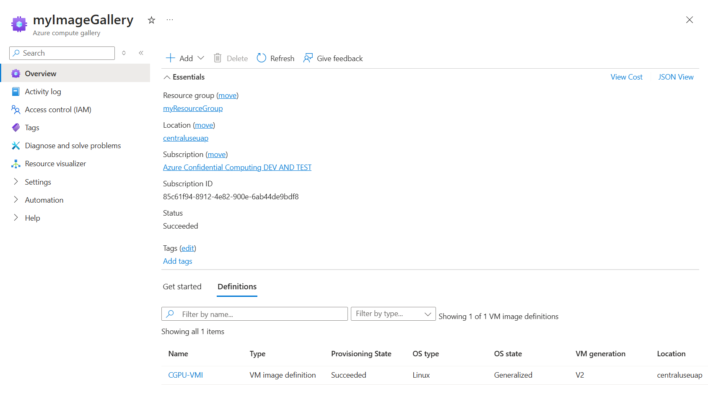
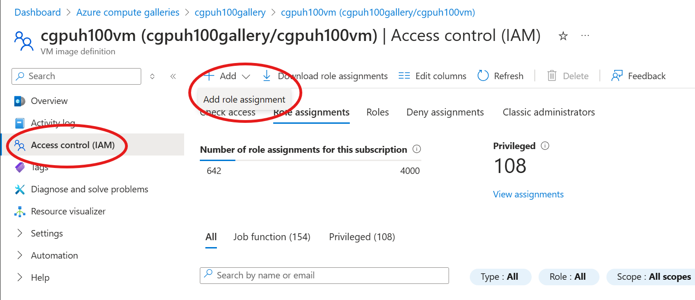
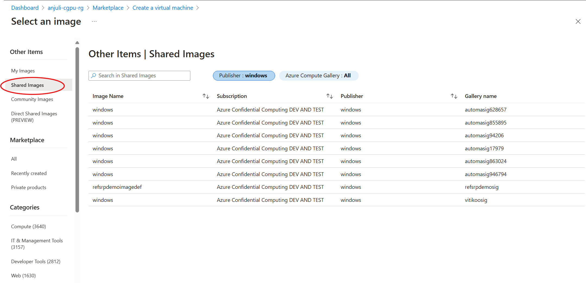

# Overview
Here is an overview of the different options to capture and share a CGPU VM image within the same subscription.

The steps involved with creating and sharing a virtual machine image (VMI) are as follows:
1. Create an image gallery with an image definition and an image version based off your CGPU VM
2. Share your image
3. Use the shared image

If you have already created an Azure image gallery and definition, skip to the instructions on how to [share your VMI](#sharing-within-a-subscription).If not, refer to the following instruction on how to set up your image gallery and definitions:

## Create an image definition and version
Detailed documentation on creating an image definition and image version can be found [here](https://learn.microsoft.com/en-us/azure/virtual-machines/image-version?tabs=portal%2Ccli2).

The general steps for creating an image definition and image version are as follows:
1. Stop your base VM, and select the 'Capture' button from within the portal
  - Note for your base VM, `ConfidentialVM` security type is required for images using Confidential disk encryption (`ConfidentialVMSupported` security type for encrypted images will fail). If the VM was created with an encrypted disk and customer-managed keys (CMK), `Confidential Disk Encryption` must be set to `True`
2. Select the `Specialized` state under `Operating system state`
3. Choose which image gallery to store your image in - this can be an existing or new one depending on your requirements
   - Extra information about image galleries can be found here: [Store and share images in an Azure Compute Gallery](https://learn.microsoft.com/en-us/azure/virtual-machines/shared-image-galleries?tabs=vmsource%2Cazure-cli)
4. Select the `Premium SSD LRS` options for the `Default storage sku`
5. Fill in all other required fields before reviewing and creating your image. Please note that this can take up to 10 minutes.
6. Now you can test your image by deploying a VM based off it!

Before moving on to the sharing steps, please ensure you have a gallery and image definition similar to this example: 


## Sharing within a subscription
Sharing the VMI is done by assigning role assignments for the specific image. This can be configured by navigating to the `Access Control (IAM)` tab and click on `Add role assignment`. Here you can select the appropriate role (eg. `Reader`, `Contributor`) for the Azure account.



## Deploying a VM based off a shared VMI
Once the VMI has been shared, there are 3 options to use it to deploy a VM:

### 1. Using the portal
If deploying a VM using the Azure portal, navigate to `Create a Virtual Machine`. Within the image section, select the browse option and search within the `Shared` tab as shown below: 

### 2. Using the Azure CLI
If deploying a VM using the Azure CLI, ensure the image reference is in the following format, where <subscription ID>, <resource group name>, <image gallery name>, <image name>, and <version number> are replaced with those from the VMI:
`image-reference = "/subscriptions/<subscription ID>/resourceGroups/<resource group name>/providers/Microsoft.Compute/galleries/<image gallery name>/images/<image name>/versions/<version number>"`

Once the image reference is in the correct format, a VM can be deployed by including this in the parameters:
```
az vm create \
  --resource-group <your-resource-group> \
  --name <your-vm-name> \
  --image <image-reference> \
  --admin-username <your-username> \
  --generate-ssh-keys
```
### 3. Using an ARM template
If deploying a VM using an ARM template, replace the storage profile image reference with the reference to the intended image as below:
```
"storageProfile": {
            "imageReference": {
                "id": "/subscriptions/<subscription ID>/resourceGroups/<resource group name>/providers/Microsoft.Compute/galleries/<image gallery name>/images/<image definition name>/versions/<version number>",
                "exactVersion": "0.0.1"
            },
```

Then the ARM template can be used to deploy using the Azure CLI:
```
az deployment group create \
  --resource-group <your-resource-group> \
  --template-file <your-ARM-template> \
  --parameters vmName=<your-vm-name> adminUsername=<your-username> adminPassword=<your-password>
```
